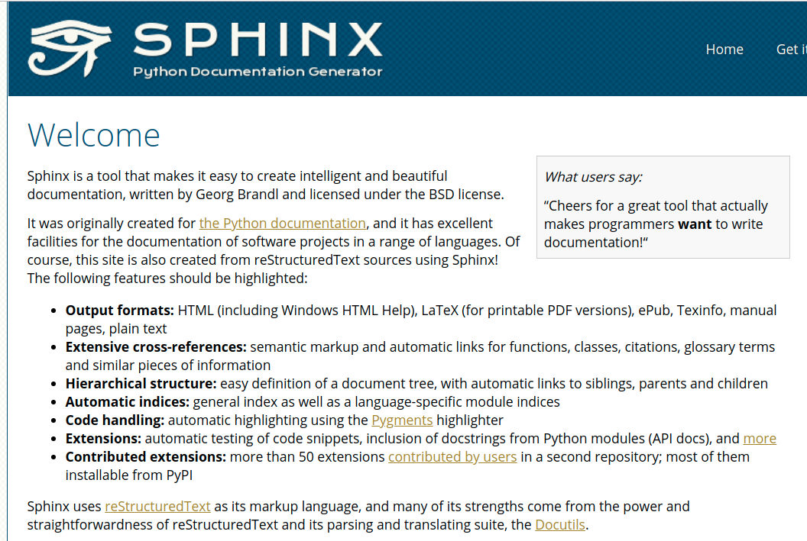
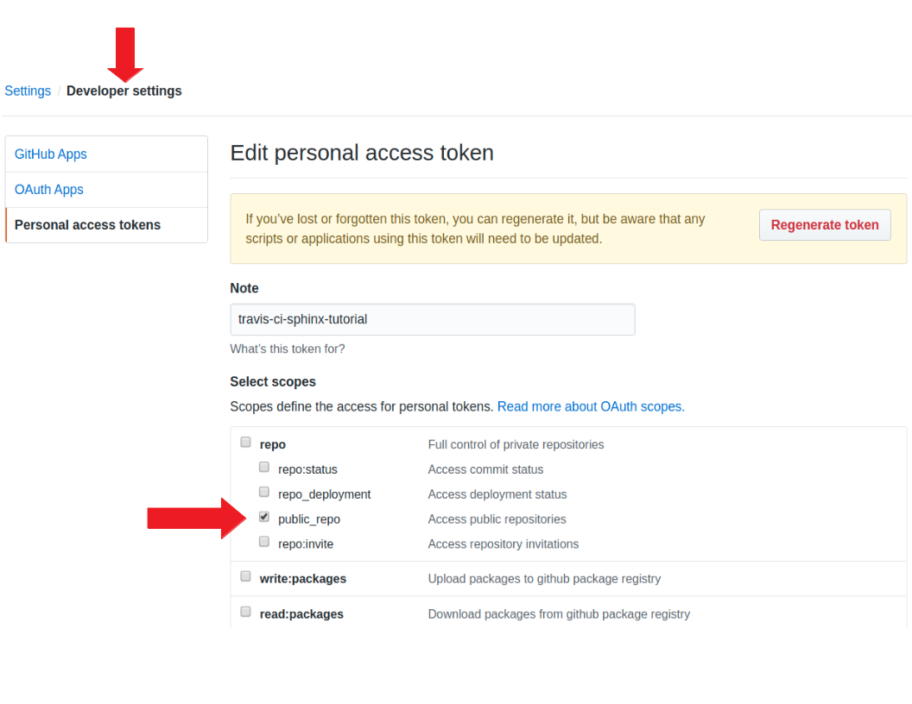
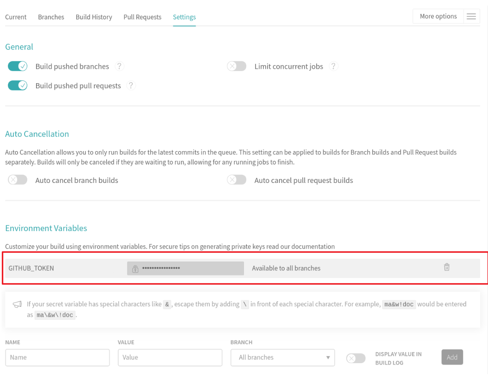
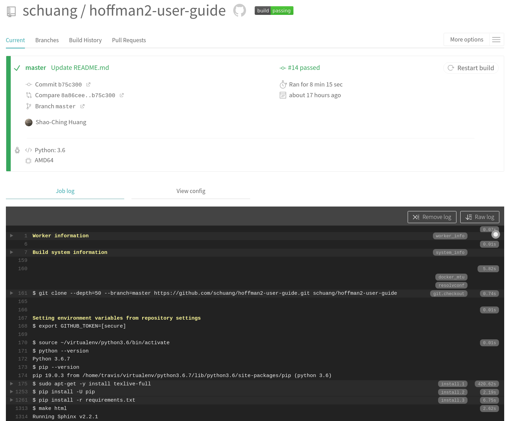
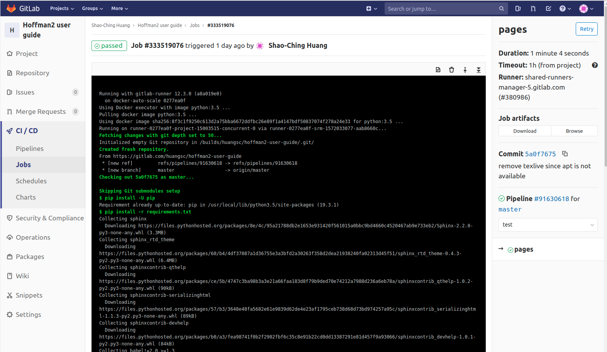

# Technical documentation workflow

- Not the same as writing a blog article

- Write: to focus only on contents

    - Principle of separation: contents vs. layout/formatting

- Review: easy to see changes, revert, comment, collaborate etc.

    - git version control's pull request/merge request

- Publish: automation!

- Other considerations

    - Subject experts are not necessarily web developers

    - Multiple formats of the same contents may be needed (e.g. web pages and pdf)


# What is Sphinx


- Sphinx converts reStructuredText files into HTML websites and PDF, EPub, Texinfo and man.

- reStructuredText (RST, ReST, or reST) is a file format for textual data for technical documentation.
    - a more powerful markdown without diverging flavors




# Using Sphinx with CI: the big picture


# Advantages of using Sphinx

- Based on text files
  - Use one's favoriate editor/local environment for writing
  - Easy to track changes using version control
  - Standard git pull (or merge) request review process
  - Easy to programmatically manipulate the text files, if needed
  - The entire workflow is open-source based, no vendor lock-in

- Generate static HTML pages 
  - No security concerns
  - No need to additional maintain WordPress and plugins
  - Can use free hosting services (github, gitlab, read the docs, etc.) if desired


# Sphinx demo

- view the source

    - [`https://github.com/schuang/sphinx-tutorial`](https://github.com/schuang/sphinx-tutorial)

- view the site

    - [`https://schuang.github.io/sphinx-tutorial`](https://schuang.github.io/sphinx-tutorial)

# Continuous integration/deployment (CI/CD)


# Travis CI

(what is Travis CI)


There are also several other popular CI systems...


# Enabling Travis CI on a Github repository


- Create an access token in github.com
    
- Past the access token into Travis CI
    - e.g. `$GITHUB_TOKEN`
    - Use it in `.travis.yml`


Other CI/CDs have a similar procedure, e.g. `gitlab.com`


# github.com personal access token




# travis-ci.com environment variable




#  {.allowframebreaks}

```bash
$ cat .travis.yml
```

```yaml
language: python
branches:
  only:
  - master
python:
- '3.6'
install:
- pip install -U pip
- pip install -r requirements.txt
script:
- make html
deploy:
  provider: pages
  skip_cleanup: true
  github_token: $GITHUB_TOKEN
  local_dir: build/html
  on:
    branch: master
```


# pip-install additional packages

```bash
$ cat requirements.txt 
```

```
sphinx
sphinx_rtd_theme
recommonmark
```

# Travis CI jobs




# gitlab pages pipeline

- similar to Travis CI
- use `.gitlab-ci.yml` (different syntax than `.travis.yml`)
- Can use arbitrary docker image from docker hub
- CI is ingegrated in gitlab, so no need to create the access token
- use `/public`

# 

```bash
$ cat .gitlab-ci.yml 
```

```yaml
image: python:3.6

pages:
  script:
    - pip install -U pip
    - pip install -r requirements.txt
    - make html
    - mv build/html/ public/
  artifacts:
    paths:
      - public
  only:
    - master
```


# gitlab pipeline jobs 




# Additional Sphinx settings in `conf.py`

To support Github pages:

```python
extensions = [ 'sphinx.ext.mathjax',
               'sphinx.ext.githubpages' ]
```

To also support markdown source files:

```python
source_suffix = { '.rst': 'restructuredtext', 
                  '.md' : 'markdown' }
```


# Travis CI demo

What to look?

- See the github repository and travis-ci.com
- Commit to github triggering Travis CI build job
- Watch the "job log" in real time
- Build status badge


# Summary

- Sphinx is a mature and powerful documentation generator
    - Designed for technical documentation
    - Used by many high-profile projects
    - Can easily include images, math, and code listing in style
    - Static web pages are light-weight, robust, and have no security issues
    
- Single source, multiple output formats
    - text files in ReST or markdown formats
    - Start-of-the-art version control (git) workflow
    - Customizable outputs in HTML, pdf, epub, etc.
    
- Continuous integration/deployment (CI/CD) and hosting services automate and simplify workflow


